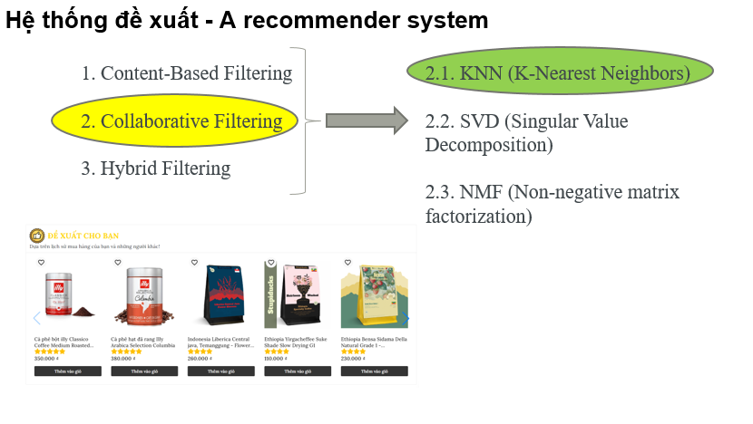
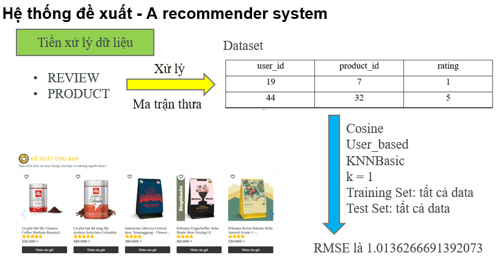
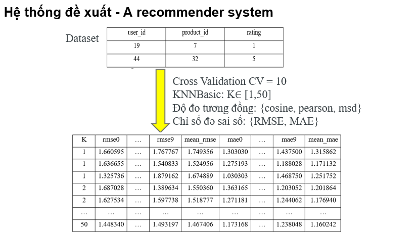
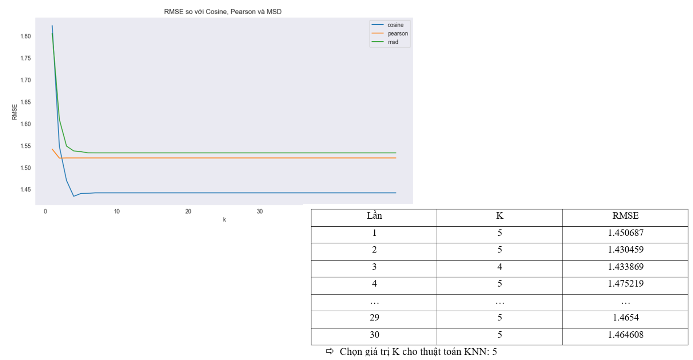
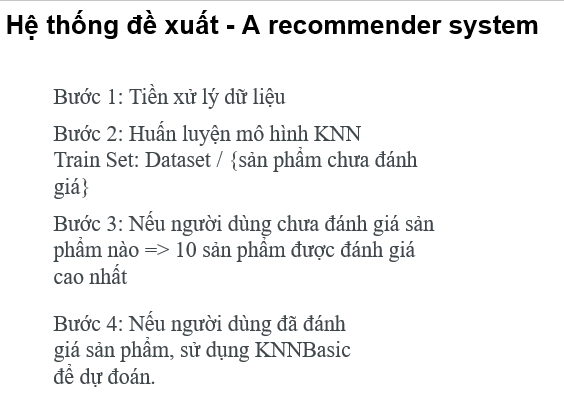
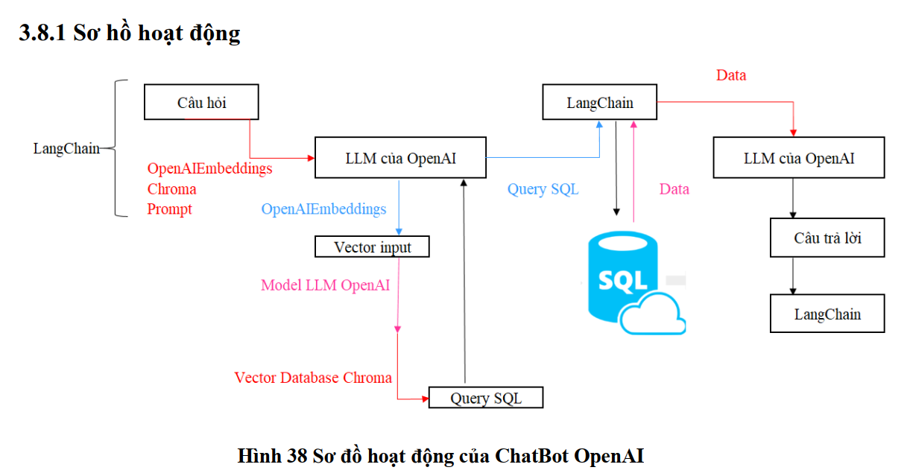

Source nguồn front-end: https://github.com/Arkadian404/filtro_jwt.git
Source nguồn back-end: https://github.com/Arkadian404/filtro_jwt_backend.git
Source nguồn fast-api: https://github.com/Arkadian404/recommender_system_api.git

# Phân công
### Giai đoạn 1: 07/2023 - 12/2023

#### Võ Văn Đức (25-30%)
- Xây dựng cấu trúc source code cho back-end Spring Boot (Model, Database) và front-end Angular
- Cấu hình security cho back-end
- Thực hiện chức năng trang home, cart, checkout, trang quản lý sản phẩm và hình ảnh sản phẩm
- Thực hiện chức năng thanh toán Momo
- Viết tài liệu

#### Ôn Gia Phú (65-70%)
- Thực hiện các chức năng quản lý các thông tin ở trang quản trị, thống kê
- Thực hiện chức năng:
  - Đăng nhập (giao diện), đăng ký, quên mật khẩu
  - Xem, lọc danh sách sản phẩm; tìm kiếm sản phẩm; chi tiết sản phẩm; bình luận sản phẩm
  - Sự kiện giảm giá; sử dụng API giao hàng nhanh
- Thực hiện chức năng thanh toán Vnpay

### Giai đoạn 2: 01/2024 - 07/2024

### Hệ thống gợi ý sản phẩm dựa trên hành vi người dùng – thuật toán KNearest Neighbor KNN

#### Võ Văn Đức
- Tiền xử lý dữ liệu
- Xác thực mô hình
- Chọn K
- Xây dựng hàm

#### Ôn Gia Phú
- Xây dựng hàm (chính)
- Xây dựng UI/UX

### Chatbot AI với Model LLM của Open AI

#### Võ Văn Đức
- Kiểm tra với Model LLM của Hugging Face
- Viết Prompt cho Chatbot
- Xây dựng hàm

#### Ôn Gia Phú
- Xây dựng hàm (chính)
- Xây dựng UI/UX

### Triển khai dự án sử dụng VPS, Docker Compose, Nginx

# Filtro - Project Overview
- URL: https://filtrocoffee.com/home
- This project aims to replicate the functionality of an e-commerce website. It offers a comprehensive suite of features that cater to both customers and store managers.
  
# Technologies Used
- Front-end: Angular
- Backend: Spring Boot
- Database: SQL
- Recommender System: K-nearest neighbors (KNN) via the Surprise library of Python
- ChatbotAI: the LLM of OpenAI via the LangChain library of Python

## Features

### For Customers
- **Store Information**: Provides details about the store.
- **Order Placement**: Allows customers to place orders for their desired products.
- **Payment Gateway**: Facilitates payment transactions for purchases through the Momo e-wallet and the VnPay payment gateway.
- **Recommender System**: Propose 10 products for the user.
- **Chatbot AI**: Users can quickly look up information through the AI chatbot system via OpenAI's LLM.

### For Store Management
- **User Information Management**: Handles the data related to store users.
- **Product Management**: Involves adding, updating, and removing products.
- **Order Management**: Tracks and manages customer orders.
- **User Role Assignments**: Administers the roles and permissions of users on the website.

## Admin Account

**Username**: admin  
**Password**: Piotthed@rkness1

## Main Features

### E-commerce Functionalities
- Provided functionalities of an e-commerce website, including viewing items, managing the shopping cart, order placing for customers, and shop management for employees.

### Security
- Utilized Spring Security and JWT tokens for managing authentication and authorization.

### Payment Integration
- Payment is handled through Momo e-wallet and Vnpay payment gateway.

### Recommender System
- Implement the product recommendation system using the K-nearest neighbors (KNN) algorithm through the Surprise library in Python.
- Propose 10 products for the user after login.
  - If there are no confirmed orders, there will be no product recommendation system.
  - If there are any confirmed orders in the user's account and the user hasn't commented on any product, the system suggests the 10 highest-rated products in the database.
  - If there is a confirmed order, the system suggests the 10 highest-rated products based on previous reviews from this account.

### Chatbot AI
- Users can quickly look up information through the AI chatbot system via OpenAI's LLM.

# ===================================================================================================================

## 1. Provided functionalities of an e-commerce website, including viewing items, managing the shopping cart, order placing for customers, and shop management for employees.

### 1.1. Account registration and login
- Registration
  

- Register successfully
  

- Login
  

- Login successfully
  

### 1.2. View homepage, products, product details

### 1.3. View, add, remove products from the shopping cart

### 1.4. Place Cash on Delivery (COD) orders
- Used API of GiaoHangNhanh

## 2. Payment is handled through Momo e-wallet and Vnpay payment gateway.

### 2.1. Payment through Momo e-wallet

- At the homepage of Momo's application

  
  
  

- After check out successfully, the webpage is reset.

### 2.2. Payment through Vnpay payment gateway

## 3. Utilized Spring Security and JWT tokens for managing authentication and authorization.

### 3.1. JWT tokens and permissions

- Before check the token, let's create a new employee's account with account name is "employee02" and password is "Duc2112002@"

- Here is token in the request from employee's account:

- The account permissions are hard-coded and cannot be modified.
- Employees cannot access the employee management page https://filtrocoffee.com/admin/employee
Here is the admin's account:

Here is the employe's account:

After employee's account access the employee management page https://filtrocoffee.com/admin/employee, the website will return to the home page https://filtrocoffee.com/admin/home

### 3.2. Incorrect login

### 3.3. Access denied when trying to access unauthorized areas (before and after login)
- Without login: Let's access this url without login: https://filtrocoffee.com/admin/employee, the website will return to the admin login page.

- After login, the website will return to the home page of shop.

## 4. Recommender System.
- If there are any confirmed orders in the user's account and the user hasn't commented on any product, the system suggests the 10 highest-rated products in the database.
- If there is a confirmed order, the system suggests the 10 highest-rated products based on previous reviews from this account.

## 5. Chatbot AI.

